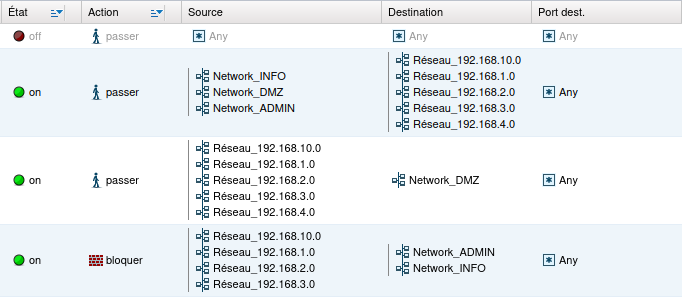

# Installation et configuration du Firewall

## Choix du modèle de firewall

Nous avons choisi le firewall **Strormshield SN310** afin de manipuler du matériel physique en plus d'être fiable, sécurisé et utilisé en milieu professionnel.

## Accès et installation du firewall

Pour le mettre en place, il faut tout d'abord brancher le port 1 (OUT) à une machine et le port 2 (IN) à un switch.

Ensuite, il faut ajouter une adresse IP à l'interface enp3s0 dans le même réseau du firewall afin d'accéder à son panneau de configuration web.

L'adresse IP de base du firewall étant **10.0.0.254**, on ajoute une adresse IP en faisant la commande : 

```bash
sudo ip a add 10.0.0.10/8 dev enp3s0
```
Pour accéder à l'interface web il faut se rendre sur **https://10.0.0.254/admin** sur la machine dont le firewall est branché et mettre le login/mot de passe demandé (par défaut **admin/admin** et si besoin le réinitialiser avec le bouton à l'arrière en le maintenant pendant 5 secondes).

Si tout se passe bien, on arrive sur le tableau de bord du Stormshield.

Pour y accéder depuis minicom, il faut brancher le câble console sur la machine puis lancer minicom en faisant : 

```bash
minicom -D /dev/ttyUSB0
```
Si une erreur apparait, faire `ls /dev/ttyUSB*` pour lister les ports USB actifs et changer selon la réponse.

En arrivant dans minicom, des caractères non voulus apparaissent si la vitesse de transmission est à 9600 bauds et il faut changer cette valeur pour accéder au firewall.

Pour cela, faire CTRL-A et P puis appuyer sur E et entrée (E est l'option pour la vitesse de 115200 bauds).

Si tout a fonctionner, on nous demande un login/mot de passe et on peut passer à la configuration.

## Configuration du firewall

### Connexion entres services

Afin de faire connaître les différentes machines de l'infrastructure pour tous les services, il faut ajouter les interfaces correspondantes sur le firewall.

Il faut aller dans la catégorie Réseau -> Interfaces, puis ajouter une interface pour chaque service et cela doit correspondre avec le câblage des machines physiques au firewall.

Puis mettre le nom du service et en IP fixe en ajoutant l'IP qui correspond aux services :

- INFO -> 192.168.4.126
- DMZ -> 192.168.4.62
- ADMIN -> 192.168.4.190

Il faut aussi ajouter une route dans la table de routage dans la catégorie Réseau -> Routing. Dans le réseau de destination il faut mettre l'objet **Network_internals** qui correspond à tous nos réseaux internes et pour l'Interface mettre l'objet **Internet** et en passerelle le routeur 1 (192.168.4.254).

Il faut ajouter dans le filtrage NAT 2 règles pour pouvoir installer les paquets au lancement des machines et assurer la connectivité des services.

En réseau source, il faut mettre l'objet réseau du service voulu (ici informatique et administratif), en destination et destination port on laisse en Any, pour la source il faut mettre l'ip du firewall (192.168.4.253) et laisser le reste par défaut.

### Connexion entres organisations

La table de routage du firewall est à compléter pour pouvoir par exemple envoyer des mails aux autres organisations.

Pour ça, il faut ajouter une route où le réseau de destination est une des organisations (192.168.1/2/3.0). En interface, il faut mettre l'objet **Internet** pour sortir du réseau et mettre en passerelle le routeur 1 (192.168.4.254).

Puis une autre route pour le réseau 192.168.10.0 avec les mêmes paramètres pour avoir accès à notre Internet.

### DHCP entres services

Pour que le DHCP soit fonctionnel entre le service informatique et administratif il faut que le firewall soit utilisé en tant que relais DHCP.

Pour cela il faut se rendre sur l'interface web et aller dans la catégorie Réseau -> DHCP, puis cocher **DHCP relay** et mettre l'IP/l'objet qui correspond au serveur DHCP et appliquer les changements.

### Règles de sécurité

