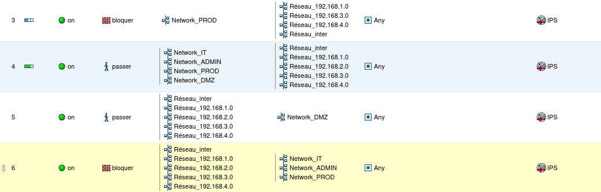
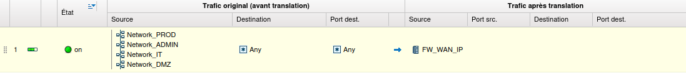

# Compte rendu final équipe rouge

- Dekeiser Matisse
- Eckman Nicolas
- Koudamra Wassim

## Infrastructure réseau

L'équipe s'occupant de faire FAI s'est occupé de nous attribuer les plans d'adressage des différents groupes et nous a attribué le réseau 192.168.2.0/24. Pour ce projet nous avons besoin de découper ce réseau en 5 sous réseaux, nous allons donc le découper en sous réseaux /27 ce qui nous laisse la place pour 8 sous réseaux et 30 machines utilisables par sous réseaux.

## Sous réseaux utilisés

| Nom du service | Sous-réseau      | Intervalle d'adresses         | Masque          |
|----------------|------------------|-------------------------------|-----------------|
| DMZ            | 192.168.2.0/27   | 192.168.1.1 - 192.168.1.30    | 255.255.255.224 |
| Production     | 192.168.2.32/27  | 192.168.1.33 - 192.168.1.62   | 255.255.255.224 |
| Administratif  | 192.168.2.64/27  | 192.168.1.65 - 192.168.1.94   | 255.255.255.224 |
| Informatique   | 192.168.2.96/27  | 192.168.1.97 - 192.168.1.126  | 255.255.255.224 |
| Lien routeur   | 192.168.2.224/27 | 192.168.1.225 - 192.168.1.254 | 255.255.255.224 |

## Interfaces firewall

Dans notre infrastructure nous avons décidé de tout centraliser autour du firewall, nous avons donc du utiliser une interface par ordinateur physique et une interface pour le routeur.

Il faut savoir que l'interface 1 est l'interface "out" du firewall, elle sera donc l'interface utilisée pour la liaison entre les différents groupes. L'interface 2 est l'interface "in", soit l'interface utilisée pour configurer le firewall via l'interface utilisateur sur l'ip 10.0.0.254, ce qui nous demandait d'ajouter l'ip 10.0.0.253/24 à l'un des pc pour pouvoir configurer le firewall. Les autres interfaces sont donc disponible à l'utilisation, l'interface 3 est l'interface DMZ, l'interface 5 est l'interface production, l'interface 6 est l'interface administratif et l'interface 7 est l'interface informatique.

Pour ce qui est des adresses IP nous avons affecté à chaque interface du firewall la plus petite IP disponible du sous réseau, ainsi que pour l'IP des PC douglas qui avaient la 2eme plus petite IP disponible.

## Politiques de sécurité et NAT

Sur ce projet nous avions pour consigne d'interdire l'accès à nos réseaux privés par les autres groupes tout en laissant l'accès à notre réseau public DMZ, soit les règles suivantes :
- accès aux réseaux
    - 192.168.1.0/24
    - 192.168.3.0/24
    - 192.168.4.0/24
- accès au réseau d'interconnexion 192.168.10.0/24
- interdiction aux autres groupes d'acceder aux services prod, infra et informatique
- obligation du service de production de passer par un proxy web pour avoir accès aux réseaux externes.

Nous avons ensuite mis en place un NAT pour pouvoir communiquer avec l'exterieur tout en masquant nos adresse privées.

  

## Services DMZ

Notre service DMZ nous permet de déployer différents services tels qu'un serveur web, un serveur mail et un serveur DNS.

### Serveur web

Serveur web vitrine déployé avec nginx et qui contient un fichier XML d'auto configuration pour thunderbird.

### Serveur mail

Serveur permettant l'échange de mails entre les différents groupes utilisant PostFix et Dovecot  

### Serveur DNS

Serveur DNS utilisant Bind9 servant d'autorité pour le nom de domaine rouge.IUT 

## Services production

Le service de production et administratif contiennent 2 stations de travail. Le service de production utilise un proxy passant par l'ip 192.168.2.102 pour avoir accès à l'exterieur.

### Stations de travail

Machines équipées de :
- PostFix (SMTP)
- Dovecot (IMAP)
- Thunderbird (Mail)
- Firefox (Navigateur)

## Services informatique

Sur le service informatique nous avons déployé 4 services dont un serveur DHCP, un serveur LDAP, un serveur NFS et un proxy web utilisé par le service de production. Une station de travail se trouve également dans ce service.

### Serveur DHCP

Le serveur DHCP attribue les IP aux différentes stations de travail se trouvant dans les 3 services prod admin et informatique.

### Serveur LDAP

Le serveur LDAP S'occupe de la mise en place d'un annuaire centralisé, qui sera utilisée principalement par le serveur mail et qui nous permettra d'utiliser ces utilisateurs pour envoyer des mails et se connecter aux stations de travail.

Les différents utilsateurs sont mdekeiser, neckman et wkoudamra.

### Serveur NFS

Le serveur NFS stocke les dossiers /home des différents utilisateurs LDAP pour pouvoir les reutiliser sur les autres stations de travail.

### Proxy web

Le proxy web sert d'intermédiaire entre les stations de travail du sous-réseau de production et les services publiques des autres organisations.

## Récapitulatif des services

| Nom du serveur | État         | Service | Technologie utilisée |
|----------------|--------------|---------|----------------------|
| Web            | Opérationnel | DMZ     | Nginx                |
| Mail           | Opérationnel | DMZ     | Postfix + Dovecot    |
| DNS            | Opérationnel | DMZ     | Bind9                |
| DHCP           | Opérationnel | IT      | isc-dhcp             |
| LDAP           | Opérationnel | IT      | OpenLDAP             |
| NFS            | Opérationnel | IT      | nfs-kernel           |
| Proxy          | Opérationnel | IT      | Squid                |

## Difficultés rencontrées

La principale difficulté à été le manque de communication au sein de notre groupe mais aussi et surtout avec le groupe FAI que nous n'avons aue très peu sollicité et qui ne nous a également pas demandé si tout fonctionnait.

Au niveau technique la découverte du stormshield à également été un frein sachant que c'est notre coeur de réseau, il était donc assez compliqué d'avancer sans que tout soit opérationnel.