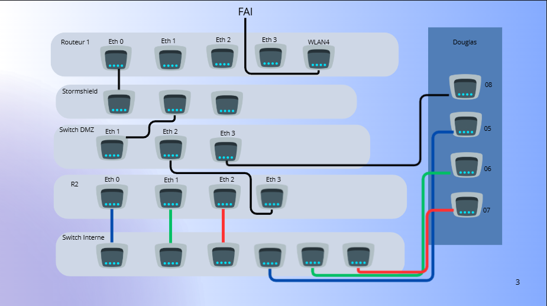
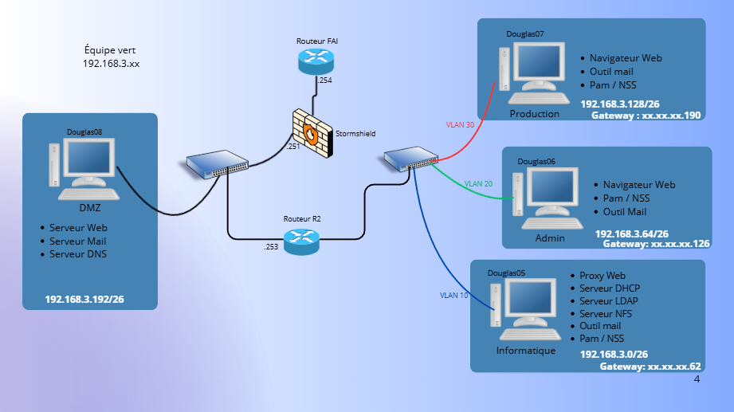

# Introduction

Cette section présente l’architecture réseau mise en place pour l’organisation verte.
Elle décrit la structure globale du réseau, les équipements utilisés, la segmentation des différentes zones ainsi que les principes de routage.

# Vue d’ensemble de l’architecture
L’architecture réseau repose sur une segmentation claire entre une  **DMZ**, trois sous-réseaux privés distincts : informatique, administratif et production.
L’ensemble de l’infrastructure est interconnecté via des équipements réseau dédiés tels qu'un routeur et des commutateurs.
## Schéma réseau

### Schéma physique



### Schéma de service



## Plan d'adressage

### PLan des sous-réseau

| Zone réseau            | Sous-réseau IP | Masque / CIDR | Passerelle par défaut | Usage principal |
|------------------------|---------------|---------------|-----------------------|-----------------|
| DMZ                    |192.168.3.192  |/26|192.168.3.254| Services publics (DNS, mail, web) |
| Service informatique   |192.168.3.0    |/26|192.168.3.62| Services internes et administration |
| Service administratif  |192.168.3.64   |/26|192.168.3.126| Postes utilisateurs administratifs |
| Service de production  |192.168.3.128  |/26|192.168.3.190| Postes de production (accès via proxy) |

### PLan des service

| Équipement / Service        | Zone réseau          | Adresse IP | Rôle |
|-----------------------------|----------------------|------------|------|
| Routeur R1                  | sortie de notre réseau (proprieté FAI)      |192.168.3.254| Routage inter organisation |
| Routeur R2                  | DMZ/ Services        |192.168.3.253| Routage interne |
| Pare-feu                    | Frontière réseau     |192.168.3.251| Filtrage des flux |
| Serveur DNS                 | DMZ                  |192.168.3.194| DNS autoritaire |
| Serveur de messagerie       | DMZ                  |192.168.3.194| Mail |
| Serveur web                 | DMZ                  |192.168.3.194| Web |
| Serveur DHCP                | Service informatique |192.168.3.2| Attribution IP |
| Serveur LDAP                | Service informatique |192.168.3.3| Annuaire |
| Serveur PAM NSS             | Service informatique |192.168.3.4| authentification |
| Serveur NFS                 | Service informatique |192.168.3.5| Stockage |
| Proxy web                   | Service informatique |192.168.3.6| Accès web production |
| Poste de travail informatique | Service informatique |192.168.3.7/61| Accès web production |
| Poste de travail administratif | Service administratif |192.168.3.66/125| Accès web production |
| Poste de travail production| Service production |192.168.3.130/189| Accès web production |


# Exportation de la configuration

Dans cette section, on va copier les configurations des éléments réseaux pour que l'architecture réseau soit opérationnelle.

pour importer une configuration, on procède de la sorte :
Effacer la configuration actuelle de l'élément réseau.
Brancher le port COM de Douglas 6 ou 8 sur l'élément réseau voulu sur la baie.
Ouvrir Minicom avec la commande Minicom, passer en enable puis en conf. Ensuite, faire CTRL-A puis S pour envoyer une configuration.
Choisir l'option ascii, puis sélectionner le fichier de configuration.
Si tout va bien, la config va s'écrire toute seule.
Pour vérifier si la configuration est bien mise, on peut utiliser la commande :

`show running-config`

Si dans la configuration il y a des éléments non voulus, il faut les supprimer car la configuration s'écrit par-dessus la configuration existante.
Cette méthode va permettre de récupérer la configuration afin d'en avoir la sauvegarde sur notre machine physique.

## Routeur R2

Dans la configuration du routeur 2, on y instancie des VLAN pour la séparation des flux des gateway pour ces différents VLAN et des IP route pour sortir du réseau de l'organisation.

[fichier de configuration du Routeur 2](./routeur2-config.txt)


## Switch SW1

Dans la configuration du switch 1, on y instancie des VLAN pour la séparation des flux.

[fichier de configuration du switch de la zone privée](./switch-private-config.txt)

## Switch SW2 

Dans la configuration du switch 2, il n'y a aucune configuration particulière. 

[fichier de configuration du switch de la DMZ](./switch-dmz-config.txt)

## Configuration des différents serveurs

Pour relier les machines statiques, comme les serveurs, au réseau, on crée d'abord une VM Vagrant comme cela.
Dans cet exemple, on est dans le sous-réseau de la DMZ. On va toujours se bridger à EnP3S0 car c'est la carte réseau reliée à la baie pour tous les postes.
```
Vagrant.configure("2") do |config|
  config.vm.box = "debian/bookworm64"

  config.vm.define "DMZ-vert" do |vm|
    vm.vm.hostname = "DMZ-vert"
    vm.vm.network "public_network",
      ip: "192.168.3.194",
      netmask: "255.255.255.192",
      bridge: "enp3s0"
  end
end
```
Et ensuite on exécute ce script sur la machine virtuelle.

```
#!/bin/bash

sudo ip r add 192.168.0.0/16 via 192.168.3.254 dev eth1
sudo ip r add 192.168.3.0/24 via 192.168.3.253 dev eth1

echo "
domain vert.iut
search vert.iut
nameserver 192.168.3.194
" > /etc/resolv.conf

```

# Test et Validation

Pour valider le réseau, on va faire créer une machine sur chacun des réseaux avec la procédure ci-dessus. 

Attention, les scripts doivent être modifiés selon la gateway et les sous-réseaux où ils sont exécutés.


[Script DMZ](equipe-vert/bin/d8_Documents/DMZ/conf_vm_dmz)
[Script réseau informatique](equipe-vert/bin/d5_Documents/service_info/conf_vm_info)
[Script réseau administratif](equipe-vert/bin/d6_Documents/service-admin/conf_vm_admin)
[Script réseau production](equipe-vert/bin/d7_Documents/service_prod/conf_vm_prod)

Ensuite, sur tous les postes, on ping chaque autre poste, tout doit fonctionner.
Puis sur tous les postes, on ping la DMZ d'une autre équipe. À ce stade, tout doit fonctionner, même la production. Elle va être bloquée par la suite grâce au firewall.

Ensuite, on détruit toutes les VM créées pour le test.