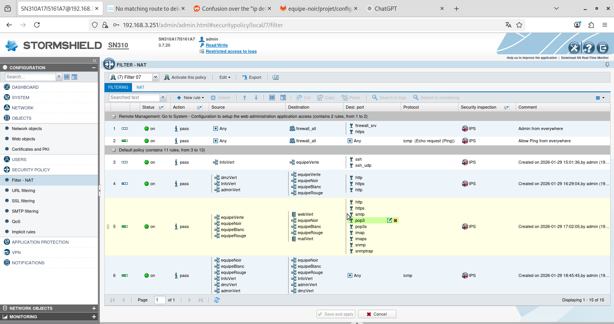
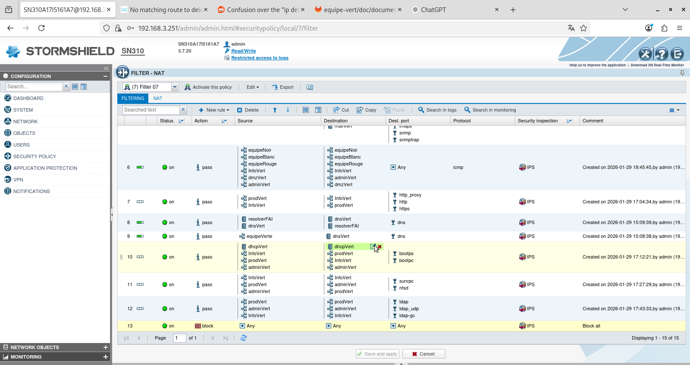

# Sécurisation de l’infrastructure

# 1.Principes généraux de sécurité

La sécurisation de l’infrastructure repose sur une segmentation stricte des réseaux, un contrôle fin des flux et l’application du principe du moindre privilège.
Chaque zone (DMZ, réseau administratif, réseau de production, réseau d’information) dispose de règles spécifiques limitant les communications aux seuls services nécessaires.

Un pare-feu central assure :

le filtrage des flux entrants et sortants,

le blocage par défaut de tout trafic non explicitement autorisé.

# 2.Segmentation des zones réseau

L’architecture est découpée en plusieurs zones logiques :

DMZ : hébergement des services exposés (web, mail, DNS).

Réseau Information (Info) : postes utilisateurs standards.

Réseau Production (Prod) : postes et services liés à la production.

Réseau Administratif (Admin) : administration des systèmes.

Les communications inter-zones sont strictement contrôlées par des règles de filtrage dédiées.

#3.Politique de filtrage du pare-feu

## 3.1.Politique par défaut

Politique par défaut : blocage total

Toute communication non explicitement autorisée est refusée (deny any any).

Cette règle garantit qu’aucun flux imprévu ne peut circuler.

## 3.2.Accès aux services de la DMZ

Les services exposés dans la DMZ sont accessibles uniquement via les ports nécessaires :

Serveur Web

HTTP (80)

HTTPS (443)

Serveur de messagerie

SMTP

POP3 / POP3S

IMAP / IMAPS

Serveur DNS

DNS (53)

Les flux sont limités aux zones autorisées et inspectés par le module IPS.

## 3.3Services internes autorisés

Les communications internes sont autorisées uniquement pour les services indispensables :

DNS

Résolution interne et vers le résolveur FAI

DHCP

BOOTPC / BOOTPS entre les réseaux internes et le serveur DHCP

LDAP

LDAP, LDAP-UDP, LDAP-GC pour l’annuaire

NFS

SUNRPC et NFSD pour le partage de fichiers

Proxy Web

HTTP / HTTPS via un proxy dédié

# 4.Conclusion

La sécurisation mise en place assure :

une isolation claire des zones,

une exposition minimale des services,

et un blocage systématique des flux non nécessaires.